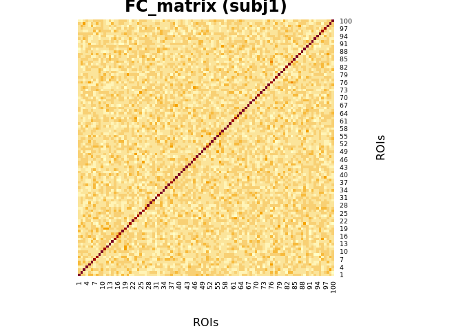
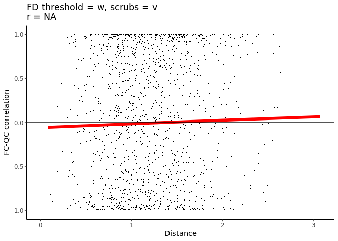

Testing Visualization
================
Ju-Chi Yu
2022-12-06

### Visualzing the correlation between euclidean distance and activation to QC for motion

#### Fake data

``` r
Dist_matrix <- list()
FC_matrix <- list()

## sub 1
set.seed(2022)
timeseries <- matrix(rnorm(10000), nrow = 100)
FC_matrix[['sub1']] <- cor(timeseries)

dim.mat <- dim(FC_matrix[['sub1']])[1]
distance <- diag(0, dim.mat)
distance[upper.tri(distance)] <- abs(rnorm(dim.mat*(dim.mat-1)/2, 1, 1))
Dist_matrix[['sub1']]  = distance + t(distance)

## sub 2
set.seed(2023)
timeseries <- matrix(rnorm(10000), nrow = 100)
FC_matrix[['sub2']] <- cor(timeseries)

dim.mat <- dim(FC_matrix[['sub2']])[1]
distance <- diag(0, dim.mat)
distance[upper.tri(distance)] <- abs(rnorm(dim.mat*(dim.mat-1)/2, 1, 1))
Dist_matrix[['sub2']]  = distance + t(distance)
```



#### Scatter plot with trend

``` r
FClist.in.vec <- lapply(FC_matrix, as.vector)
Distlist.in.vec <- lapply(Dist_matrix, as.vector)
data2plot <- data.frame(FC_vec = unlist(FClist.in.vec),
                        Dist_vec = unlist(Distlist.in.vec))

data2plot %>%
  ggplot(aes(x = Dist_vec, y = FC_vec)) +
  geom_point() +
  geom_smooth(se = FALSE, color = "red", lwd = 2) +
  geom_hline(yintercept = 0) +
  ggtitle(paste0("r = ", round(cor(data2plot$Dist_vec, data2plot$FC_vec), 2))) +
  xlab("Distance") +
  ylab("FC") +
  theme(panel.grid = element_blank(),
        panel.grid.major = element_blank(),
        panel.background = element_blank(),
        axis.line = element_line(colour = "black"))
```

    ## `geom_smooth()` using method = 'gam' and formula 'y ~ s(x, bs = "cs")'

<!-- -->

#### With the function

The `plot_DistFC` can be used to plot the correlation plot between
functional connectivity (FC) and distance (the diagonals of both
matrices are not included). The aim of this figure is to help check if
there is a bump when their euclidean distance in the 3D space is small.
If so, it means that there is a motion effect in the functional
connectivity data. If the motion effect is removed by scrubbing, you
should see a line that is almost flat.

##### How to use `plot_DistFC`

`plot_DistFC` takes two arguments:

-   `FC_list`: A list of symmetric matrix (ROI x ROI) with functional
    connectivity.

-   `Dist_list`: A list of symmetric distance matrix (ROI x ROI) that
    describes the distances between any two ROIs.

There are also other arguments that you can specify:

-   `color.line`: The color for the estimated smoothed line. Default:
    red.

-   `lwd.line`: The width of the line. Default: 2.

-   `title`: The title of the figure. Default: NULL. When NULL, only the
    coefficient of correlation will be printed.

*Note: If you want to remove the correlation in the title, you can add
`theme(title = element_blank())` to your ggplot.*

``` r
## This is how you source the function
source("../scripts/plot_DistFC.R")

## and plot the results
plot_DistFC(FC_list = FC_matrix,
            Dist_list = Dist_matrix, 
            color.line = "red", lwd.line = 2,
            title = "FD threshold = w, scrubs = v")
```

    ## `geom_smooth()` using method = 'gam' and formula 'y ~ s(x, bs = "cs")'

<!-- -->
